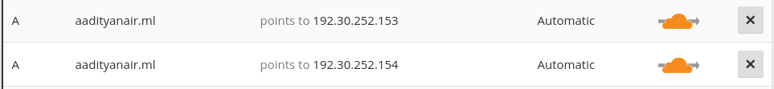
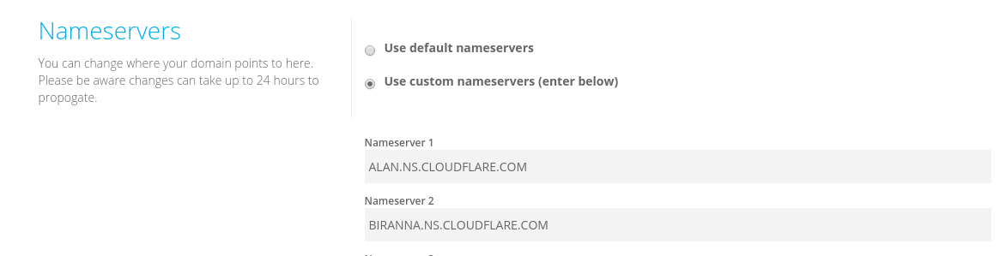

Hosting a website is nice. Also, hosting said website is easy. Github, in the form of _[github-pages]_ allows you to throw
any standard HTML content into a repository and serve it under the domain _username.github.io_.

However, like me, you would like your own custom domain for this. Setting up a custom domain for github-pages is a bit more work
than setting up the website itself. Here's how you could do it:

### Setting up the repository and verify it works.
There is really no point in going further if this doesn't work.
Create the repository and throw in some content and see if you can access it from _username.github.io_.

### Register the domain.
I am assuming that you have already done that. This step varies according to which domain registrar you are working with.
Now to add records, it depends on which type of domain you own, a subdomain (_website.example.com_) or an apex domain(_example.com_)

1. For a subdomain, simply add a `CNAME` record to `username.github.io`.
1. If you own an apex domain:
    * If your DNS provider allows for either `ALIAS` or `ANAME` records, add one of those pointing to `username.github.io`; just like above.
      However, a lot of providers, including mine, don't allow for that.
    * All providers will allow an `A` record to be added. Add an `A` record from your domain to the IP addresses,
    `192.30.252.153` and `192.30.252.154`.

And, done. To test these changes, the following command should help:
```sh
    $ dig +short @8.8.8.8 example.com A
    192.30.252.153
    192.30.252.154
```
for apex domains _and_

```sh
    $ dig +short @8.8.8.8 website.example.com CNAME
    username.github.io
```
for subdomains.

Do note that records take around a day to propagate and changes may not be immediately seen

### Informing Github of this new domain.
Now, Github won't directly recognize that you have a domain configured. So what you have to do is to go to repository settings
and add your domain in the requisite field. In your repository a file called CNAME will be added the contents of which is the configured domain.


That's it. You are done. Your website should be accessible from the custom domain.

-----------------------
## Moving to Cloudflare
Using [Cloudflare] to serve your websites has a lot of advantages. In addition to having a fast global CDN, you also get HTTPS enabled on your website
for free. It also provides DDOS protection and always-online feature, just to name a few. In general, it is a pretty good idea to serve your website
through cloudflare. Its pretty easy to do so too.

### Setting up the domain in cloudflare.
Create an account on cloudlfare and go to the _add website_ section. Enter your domain and cloudflare will try to locate all the records associated
with it and a button to select which records will be transfered to cloudflare.


Continue with the process until you see the new nameservers you have been assigned to. Go to your domain registrar and update the
DNS nameservers there. Update the new nameservers there. What this essentially does is tell your registrar that cloudflare will be the
one managing the records.


All your domains can now be managed by cloudflare now. All your requests go through them too. There is a ton of services there you can play with.

Go knock yourself out!!

**Note:** The `dig` tests above will not work after you have configured cloudflare. Cloudflare directs all traffic through them hence the IPs that
you will see will not be of Github's. Rather, they will belong to Cloudflare.

**Update (5th June, 2017):** Cloudflare DNS _actually_ supports `CNAME` for apex domains.

This will be equivalent of setting up an `ALIAS` or `ANAME` records. Refer to this excellent [blog] to see how they do it.


[github-pages]: https://pages.github.com
[Cloudflare]: https://www.cloudflare.com/
[blog]: https://blog.cloudflare.com/introducing-cname-flattening-rfc-compliant-cnames-at-a-domains-root/
