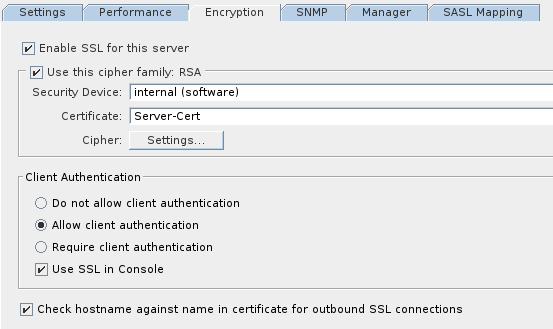

We used to host our LDAP server in a Fedora 23 server. For a critical server, Fedora was a really bad choice.
* Fedora's focus is on making upstream technologies available [early] to users.
* It has a relatively short [life cycle].

We were afraid to update in fear that things would break.

So last semester, I was asked to move our LDAP server to a CentOS machine and make it highly available while I am at it.
High availability might seem like overkill for scale we work on. But it seemed to be an interesting problem to me so
I thought, "_What the hell!! Let's do it._"

### Scope and Conventions.
This post focuses solely on setting up LDAP servers in multi-master mode and moving things to it from the old server.
Making things highly available will be discussed in the next post. This post also assumes that you are familiar with a bit of LDAP
and its implementation, **389-ds**.


We only use two servers in our setup but with some minor modifications you should be able to easily extend things for more number of
servers. `ldap-old` refers to our old LDAP server while `ldap1` and `ldap2` refers to the new machines.
We will be making use of `389-console` as well as the command-line for this post.

### Multi Master Replication
Replication is used to keep the contents of two directories in sync. All types of data modifications on one directory will be mirrored
at the other directory. The most common scenario is the _master-slave_ replication where all writes are handled only by the _master_ while
reads can be dealt with either by the _slave_ or the _master_. In most scenarios, _master_ doesn't handle any reads, only the _slave_.
Updates on the _master_ are synced with the _slave_.
In a _multi-master_ setting, all the involved directories are able to perform reads as well as writes. Hence any updates on one of them
will be reflected on the other.

To move forward, you will need to be aware of the following terms. This is taken from [RedHat Documentation]:  
**Smallest Replication Unit:** A database is the smallest unit of replication. That means only a part of the database
cant be replicated.  
**Replicas:** A replica is a database that takes part in replication process.

Our directory only has a single suffix. Hence a replica can be assumed to be the directory itself and the replication unit is the suffix.

**Suppliers and Consumers:** A supplier is the server that holds the replica that is copied to the replica in a different server.
This different server is then called the consumer. In a master-slave setting, the master is the supplier while slave is the consumer.
In our case, the multimaster setup, both the servers are suppliers as well as consumers.  
**Changelog:** The changelog is the record of all the modifications that happen in the server. The directory uses changelogs to synchronize
the data betwen servers. It is disabled by default.  
**Replication Manager:** The replication manager is a special entry in the directory with access directory data.
The supplier binds to this entry in the consumer to send data to it. In our case, we will use the entry `cn=Directory Manager`  
**Replication Agreement:** This finally defines the specifics of the replication; like the database to be replicated, the consumer
server, connection security, etc. The agreement exists only between one consumer and one supplier.  

Alright, enough talk. Lets jump into the nuts and bolts.

## Initial Setup
Installation. In `ldap1` and `ldap2` install the directory server and the admin console. Initial setup can be done by running `setup-ds-admin.pl`
Verify that both setups are working by connecting to it from 389-console and a little traversing of the available suffixes.

For the data import to go smoothly, import any custom schema that you have used. Just drop the schema files to `/etc/dirsrv/slapd-ldapX/schema/`
Also edit `dse.ldif` on both servers to change any configuration paramenters. Common parameters that could be changed are
`nsslapd-auditlog-logging-enabled` and `nsslapd-sizelimit`

**Note:** Stop the directory server before performing the above step. The directory may edit the `dse.ldif` file on its own and your changes might be lost.
Similarly, new schema will appear only after the restart.

## Setup SSL
SSL is important so that all connections to the directory are encrypted. This is especially important for authentication requests
where passwords are transferred. To set this up, I have used Parth Kolekar's [excellent post]. The commandline steps are outlined below.
The aforementioned blog mentions more techniques.

```shell-session
ldapX $ echo "Internal (Software) Token:password" > /etc/dirsrv/slapd-ldapX/pin.txt
ldapX $ chmod 400 /etc/dirsrv/slapd-ldapX/pin.txt
```
Restart the server and test using,
```shell-session $ ldapsearch -x -b <base> -H <host> -ZZ ```

To setup the certificates,
```shell-session
ldapX $ openssl pkcs12 -export -inkey iiit.ac.in.key -in iiit.ac.in.crt -out /tmp/crt.pk12 -nodes -name 'Server-Cert' # Export to pkcs12 format
ldapX $ pk12util -i /tmp/crt.pk12 -d /etc/dirsrv/slapd-ldapX/ # Import pkcs12 certificate
ldapX $ certutil -d /etc/dirsrv/slapd-<instance>/ -A -n "My Local CA" -t CT,, -a -i /path/to/root/certificate.crt  # import root CA certificates.
```

You have now imported the certificates. You now need to enable encrypted connections. This is easily done from 389-console.
Enable them at,


Restart server and test to see if things work smoothly.

## Setup Replication.
As we mentioned before, replication requires changelogs which is disabled by default. Enable it from the 389-console by
```Directory Server > Configuration > Replication > Supplier Settings > Enable Changelog```

Within the `Replication > userRoot` tab, enable replicas and enter the replica ID and the the supplier DN. Perform this for both servers
and ensure that replica id is unique for each server.

## In sync
Now we want both of the directories to be in sync with each other. Hence create a new replication agreement in each server, which sends data from
itself to the other one.
Right-Click on `userRoot` and use the wizard to create a new replication agreement. The wizard is pretty self explanatory.
Just note that once SSL has been setup, you need to use port 636 for connections rather than port 389.

The setup is like this:
```shell-session
ldap1 <-------------------> ldap2
```

With both directories synchronized, now any update on one will be reflected on the other. To test this, create an entry on one server and see
that it is reflected on the other as well.

## Get the data.
Now that both the directories are in sync, it's time we populate `ldapX` with data from `ldap-old`. To do this, simply
create replication between `ldap-old` and one of servers in `ldapX`. This ensures that the data in any of the `ldapX` is always recent
and allows us keep using `ldap-old` till we are sure that everything is peachy.

This should be the current replication scheme:
```shell-session
ldap-old -------------------> ldap1 <----------------> ldap2
```

## Testing
For testing, we want to ensure that all the requests to `ldap-old` now goes to one of `ldapX` so as to see if anything breaks.
We will change the system configuration so that `ldap1`, in addition to its own IP will have the IP of `ldap-old`.
We also configure `ldap-old` with a new temporary IP so that we can still access it.
In `ldap-old`,

```shell-session
ldap-old $ ip addr add <temp-ip>/<subnet> dev eth0
ldap-old $ exit
$ ssh <temp-ip>
ldap-old $ ip addr delete <ldap-orig-ip>/<subnet> dev eth0
```

While in `ldap1`, do this,

```shell-session
ldap1 $ ip addr add <ldap-orig-ip>/<subnet> dev eth0
```

Allow a few seconds for the machine to be discovered. After that `ldap1` will be handling the requests.

If all goes well, nothing should break. Try logging into accounts that athenticate through your directory. Everything should work
seamlessly. Now, if everything is working seamlessly, you would want that all modifications in `ldap1` to be replicated back to
`ldap-old` so that once testing should finish and you move back, data is still fresh. Similar to above, create replication from
one of `ldapX` to `ldap-old`. Use the temporary IP for `ladp-old`. The final replicaton scheme will look like this:
```shell-session
ldap-old <-----------------> ldap1 <------------------> ldap2
```


## Final words
Keep an eye on the error logs. There won't be any silent errors. After every step, look at `/var/log/dirsrv/slapd-ldapX/errors` for
anything new. Replication issues can lead to some entries not being present after sync and are very difficult to find otherwise even
in moderately small directories.

Once you see an issue you can drill down on it by changing the value of `nsslapd-errorlog-level` in `dse.ldif`. Refer [here] for find
which values you would need to set.

[early]: https://fedoraproject.org/wiki/Staying_close_to_upstream_projects
[life cycle]: https://fedoraproject.org/wiki/Fedora_Release_Life_Cycle
[RedHat Documentation]: https://access.redhat.com/documentation/en-us/red_hat_directory_server/10/html/administration_guide/managing_replication#Managing_Replication-Replication_Overview
[excellent post]: https://parthkolekar.me/blog/2016/01/03/389-ds-setup/
[here]: https://access.redhat.com/documentation/en-US/Red_Hat_Directory_Server/8.1/html/Configuration_and_Command_Reference/error-logs.html
